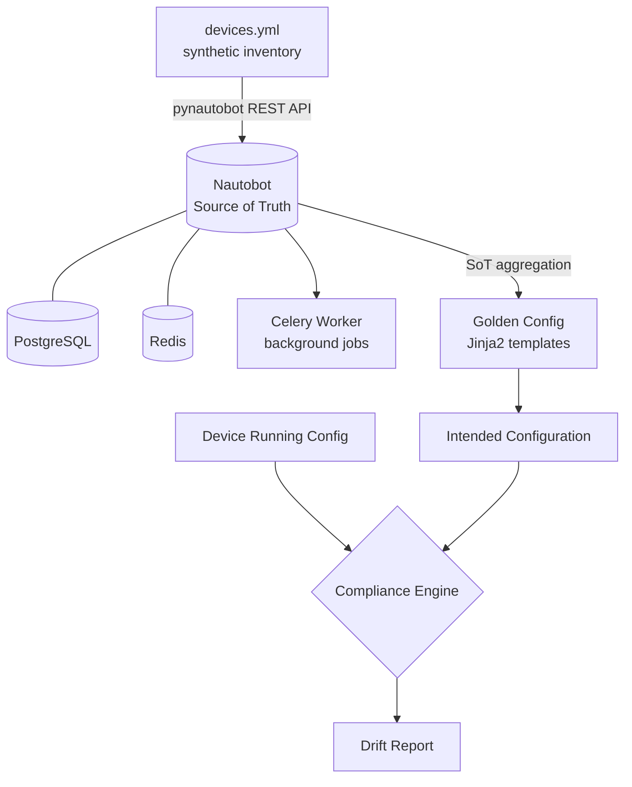

# Nautobot Network Source of Truth Lab

[](https://github.com/ambreesht789-png/nautobot-network-sot-lab/actions/workflows/ci.yml)

A self-contained, reproducible lab that demonstrates how to stand up
[Nautobot](https://nautobot.com) as a network Source of Truth (SoT), populate it
programmatically, and drive configuration compliance from it.

Everything in this repository runs locally with a single `docker compose up`.
All network data is **synthetic** — it describes a fictional logistics company
and does not correspond to any real organisation or infrastructure.

---

## Why this exists

Most networks are documented in spreadsheets that drift out of date within
weeks. A Source of Truth inverts that model: the database becomes the intended
state, and the devices are audited against it.

This lab shows the full loop end to end:

1. Model the network as structured data
2. Load it into Nautobot idempotently
3. Generate intended configuration from that data
4. Compare running configuration against intent and report the drift

---

## Architecture



| Component | Role |
|---|---|
| Nautobot 2.2 | Source of Truth — devices, IPAM, roles, platforms |
| PostgreSQL 16 | Primary datastore |
| Redis 7 | Cache and Celery broker |
| Celery worker | Executes background jobs |
| Golden Config plugin | Backup, intended config generation, compliance |
| Ansible | Config retrieval, intent rendering, compliance evaluation |

---

## The lab network

A fictional company, **Northwind Logistics**, with three locations:

| Location | Type | Devices |
|---|---|---|
| Rotterdam DC | Data Center | 7 |
| Hamburg Warehouse | Branch | 4 |
| Dublin Office | Branch | 4 |

15 devices in total across Cisco (IOS-XE, NX-OS), Juniper (Junos) and
Arista (EOS) platforms — a deliberately mixed-vendor estate, because
single-vendor automation is the easy case.

Management addressing sits in a dedicated out-of-band range (`10.255.0.0/24`),
with each site allocated its own `/16` for production traffic.

---

## Prerequisites

- Docker Engine 24+ and Docker Compose v2
- Python 3.9+ (for the seeding script)
- Roughly 4 GB of free RAM

---

## Getting started

### 1. Configure the environment

```bash
cp .env.example .env
```

Open `.env` and replace every `change-me-before-first-run` placeholder. Generate
a Django secret key with:

```bash
docker run --rm networktocode/nautobot:2.2-py3.11 nautobot-server generate_secret_key
```

> `.env` is git-ignored. No credentials are committed to this repository.

### 2. Start the stack

```bash
docker compose up -d
```

The first start takes a few minutes while Nautobot runs its database
migrations. Watch progress with:

```bash
docker compose logs -f nautobot
```

Nautobot is ready when the health check passes:

```bash
docker compose ps
```

Then browse to <http://localhost:8080> and sign in with the superuser
credentials from your `.env`.

### 3. Create an API token

In the Nautobot UI: **your user menu → API Tokens → Add**. Copy the token.

### 4. Seed the inventory

```bash
pip install -r requirements.txt

export NAUTOBOT_URL="http://localhost:8080"
export NAUTOBOT_TOKEN="<the token you just created>"

python seed/seed_nautobot.py
```

On Windows PowerShell, set the variables with:

```powershell
$env:NAUTOBOT_URL  = "http://localhost:8080"
$env:NAUTOBOT_TOKEN = "<the token you just created>"
```

You should see the objects being created, ending with a summary line.

### 5. Verify

Open the Nautobot UI and confirm you have 15 devices across 3 locations, each
with a management interface and a primary IPv4 address assigned.

---

## The automation workflow

With the Source of Truth populated, three playbooks close the loop. They are
deliberately separate: each produces an artefact on disk that the next one
consumes, so any stage can be inspected, re-run or replaced independently.

```bash
cd ansible
ansible-galaxy collection install -r requirements.yml

export NETWORK_USERNAME="<device username>"
export NETWORK_PASSWORD="<device password>"
```

### 1. Back up running configurations

```bash
ansible-playbook playbooks/backup_configs.yml
```

Reads the device list from Nautobot, retrieves each running configuration and
writes it to `backups/<device>.cfg`. Platform differences are handled in
`tasks/fetch_config.yml`, so the playbook itself stays vendor-neutral.

### 2. Render intended configurations

```bash
ansible-playbook playbooks/generate_intended.yml
```

Renders `intended/<device>.cfg` from the device's Nautobot attributes plus the
corporate standards in `group_vars/all.yml`. No device is contacted; this stage
answers "what should this look like", nothing more.

### 3. Evaluate compliance

```bash
ansible-playbook playbooks/check_compliance.yml
```

Compares the two and writes `reports/compliance-<date>.md` — a summary table,
per-device results, and the exact lines missing from each drifted device. The
play exits non-zero when anything has drifted, so it drops straight into a
pipeline as a gate.

Or run the whole sequence:

```bash
make backup intended compliance
```

> The lab devices are synthetic, so stages 1 and 3 need reachable hardware or a
> virtual topology. Stage 2 and the full validation suite run standalone. A
> Containerlab topology is on the roadmap below.

---

## Testing and CI

```bash
make validate   # seed integrity and template rendering
make lint       # yamllint, ruff, ansible-lint
```

`tests/validate_seed.py` checks that every device references a location, role,
device type and platform that actually exist, that names follow the
`<site>-<role>-<number>` convention, and that management addresses are unique
and fall inside a declared prefix.

`tests/validate_templates.py` renders every template for every device with
`StrictUndefined`, so an undefined variable fails the test rather than silently
producing an empty line in a configuration.

Both run in CI on every push, alongside linting and a Docker Compose validation.

---

## Design notes

A few decisions in this lab are worth calling out, because they are the ones
that matter when the same pattern is applied to a real network.

**The seed is idempotent.** Every object is created through a single `ensure()`
helper that looks the object up first and only creates it when absent. Re-running
the seed is therefore safe and non-destructive — the same property you need
before any automation is allowed near production.

**Data lives in YAML, not in code.** `seed/devices.yml` is the inventory
definition; `seed/seed_nautobot.py` is a generic loader. Extending the lab means
editing data, not logic.

**Objects are created in dependency order.** Statuses, locations, manufacturers
and device types, roles, platforms, prefixes, then devices. Nautobot enforces
these relationships, so the ordering is not incidental.

**Compliance comparison is line-oriented, not parser-based.** A vendor parser
gives richer results but must understand every platform's grammar. A normalised
line diff works across vendors immediately and is transparent enough that an
engineer can audit any finding by hand. Noise — timestamps, counters, encrypted
secrets — is stripped through configurable ignore patterns rather than special
cases in code.

**Missing and extra lines are treated differently.** A line the intent requires
but the device lacks is a finding. A line the device has but intent does not
model is informational by default, because no template models every local
exception on day one. Flipping `compliance_fail_on_extra_lines` tightens this
once the templates justify it.

**Nautobot 2.x conventions are used throughout.** Roles and Statuses are shared
`extras` models rather than DCIM-specific ones, IP addresses live inside a
Namespace, and an address is bound to an interface through the
`ip_address_to_interface` relationship before it can be promoted to a device's
primary IP. These are the changes that most commonly break scripts written
against Nautobot 1.x.

---

## Repository layout

```
.
├── Makefile                        # Convenience targets — run `make help`
├── docker-compose.yml              # Nautobot, PostgreSQL, Redis, Celery
├── requirements.txt                # Runtime Python dependencies
├── requirements-dev.txt            # Linting and CI tooling
├── .env.example                    # Environment template — copy to .env
├── docker/
│   └── nautobot_config.py          # Nautobot settings and plugin configuration
├── seed/
│   ├── devices.yml                 # Synthetic network inventory
│   └── seed_nautobot.py            # Idempotent loader (pynautobot)
├── ansible/
│   ├── ansible.cfg
│   ├── requirements.yml            # Ansible collection dependencies
│   ├── inventory/
│   │   └── nautobot.yml            # Dynamic inventory from Nautobot
│   ├── group_vars/
│   │   └── all.yml                 # Corporate standards and compliance rules
│   ├── tasks/
│   │   └── fetch_config.yml        # Per-platform configuration retrieval
│   ├── filter_plugins/
│   │   └── config_compliance.py    # Comparison logic
│   └── playbooks/
│       ├── backup_configs.yml
│       ├── generate_intended.yml
│       ├── check_compliance.yml
│       └── templates/              # Intended config per platform + report
├── tests/
│   ├── validate_seed.py            # Inventory integrity checks
│   └── validate_templates.py       # Renders every template for every device
└── .github/workflows/ci.yml        # Lint, validate, compose check
```

---

## Roadmap

- [x] Ansible playbooks for configuration backup
- [x] Jinja2 intended-configuration templates per platform
- [x] Compliance evaluation and Markdown drift reporting
- [x] Validation suite and CI pipeline
- [ ] Containerlab topology so the devices are actually reachable
- [ ] Nautobot Job wrapping the compliance run so it is triggerable from the UI

---

## Disclaimer

All device names, serial numbers, IP addresses, locations and the company itself
are invented for demonstration purposes. This repository contains no
configuration, data or intellectual property belonging to any employer or
client.

## Licence

MIT — see [LICENSE](LICENSE).
