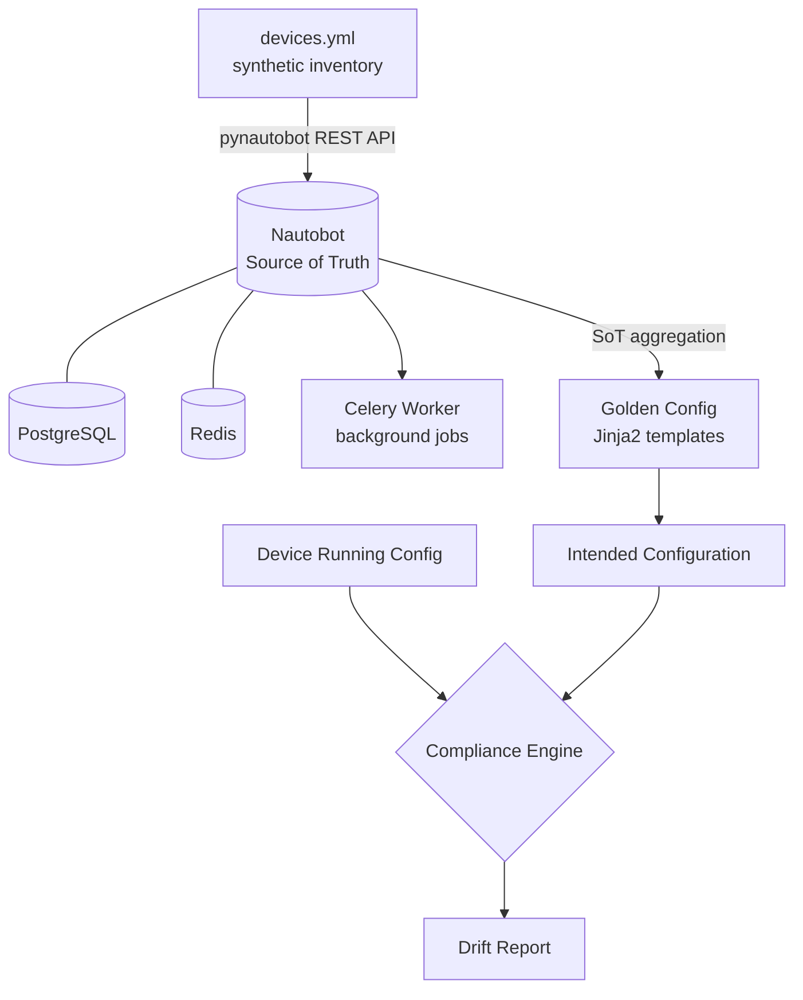

# Nautobot Network Source of Truth Lab

A self-contained, reproducible lab that demonstrates how to stand up
[Nautobot](https://nautobot.com) as a network Source of Truth (SoT), populate it
programmatically, and drive configuration compliance from it.

Everything in this repository runs locally with a single `docker compose up`.
All network data is **synthetic** — it describes a fictional logistics company
and does not correspond to any real organisation or infrastructure.

---

## Why this exists

Most networks are documented in spreadsheets that drift out of date within
weeks. A Source of Truth inverts that model: the database becomes the intended
state, and the devices are audited against it.

This lab shows the full loop end to end:

1. Model the network as structured data
2. Load it into Nautobot idempotently
3. Generate intended configuration from that data
4. Compare running configuration against intent and report the drift

---

## Architecture



| Component | Role |
|---|---|
| Nautobot 2.2 | Source of Truth — devices, IPAM, roles, platforms |
| PostgreSQL 16 | Primary datastore |
| Redis 7 | Cache and Celery broker |
| Celery worker | Executes background jobs |
| Golden Config plugin | Backup, intended config generation, compliance |

---

## The lab network

A fictional company, **Northwind Logistics**, with three locations:

| Location | Type | Devices |
|---|---|---|
| Rotterdam DC | Data Center | 7 |
| Hamburg Warehouse | Branch | 4 |
| Dublin Office | Branch | 4 |

15 devices in total across Cisco (IOS-XE, NX-OS), Juniper (Junos) and
Arista (EOS) platforms — a deliberately mixed-vendor estate, because
single-vendor automation is the easy case.

Management addressing sits in a dedicated out-of-band range (`10.255.0.0/24`),
with each site allocated its own `/16` for production traffic.

---

## Prerequisites

- Docker Engine 24+ and Docker Compose v2
- Python 3.9+ (for the seeding script)
- Roughly 4 GB of free RAM

---

## Getting started

### 1. Configure the environment

```bash
cp .env.example .env
```

Open `.env` and replace every `change-me-before-first-run` placeholder. Generate
a Django secret key with:

```bash
docker run --rm networktocode/nautobot:2.2-py3.11 nautobot-server generate_secret_key
```

> `.env` is git-ignored. No credentials are committed to this repository.

### 2. Start the stack

```bash
docker compose up -d
```

The first start takes a few minutes while Nautobot runs its database
migrations. Watch progress with:

```bash
docker compose logs -f nautobot
```

Nautobot is ready when the health check passes:

```bash
docker compose ps
```

Then browse to <http://localhost:8080> and sign in with the superuser
credentials from your `.env`.

### 3. Create an API token

In the Nautobot UI: **your user menu → API Tokens → Add**. Copy the token.

### 4. Seed the inventory

```bash
pip install -r requirements.txt

export NAUTOBOT_URL="http://localhost:8080"
export NAUTOBOT_TOKEN="<the token you just created>"

python seed/seed_nautobot.py
```

On Windows PowerShell, set the variables with:

```powershell
$env:NAUTOBOT_URL  = "http://localhost:8080"
$env:NAUTOBOT_TOKEN = "<the token you just created>"
```

You should see the objects being created, ending with a summary line.

### 5. Verify

Open the Nautobot UI and confirm you have 15 devices across 3 locations, each
with a management interface and a primary IPv4 address assigned.

---

## Design notes

A few decisions in this lab are worth calling out, because they are the ones
that matter when the same pattern is applied to a real network.

**The seed is idempotent.** Every object is created through a single `ensure()`
helper that looks the object up first and only creates it when absent. Re-running
the seed is therefore safe and non-destructive — the same property you need
before any automation is allowed near production.

**Data lives in YAML, not in code.** `seed/devices.yml` is the inventory
definition; `seed/seed_nautobot.py` is a generic loader. Extending the lab means
editing data, not logic.

**Objects are created in dependency order.** Statuses, locations, manufacturers
and device types, roles, platforms, prefixes, then devices. Nautobot enforces
these relationships, so the ordering is not incidental.

**Nautobot 2.x conventions are used throughout.** Roles and Statuses are shared
`extras` models rather than DCIM-specific ones, IP addresses live inside a
Namespace, and an address is bound to an interface through the
`ip_address_to_interface` relationship before it can be promoted to a device's
primary IP. These are the changes that most commonly break scripts written
against Nautobot 1.x.

---

## Repository layout

```
.
├── docker-compose.yml          # Nautobot, PostgreSQL, Redis, Celery
├── requirements.txt            # Python dependencies
├── .env.example                # Environment template — copy to .env
├── docker/
│   └── nautobot_config.py      # Nautobot settings and plugin configuration
└── seed/
    ├── devices.yml             # Synthetic network inventory
    └── seed_nautobot.py        # Idempotent loader (pynautobot)
```

---

## Roadmap

- [ ] Ansible playbooks for configuration backup
- [ ] Jinja2 golden config templates per platform
- [ ] Compliance rules and drift reporting
- [ ] Containerlab topology so the devices are actually reachable

---

## Disclaimer

All device names, serial numbers, IP addresses, locations and the company itself
are invented for demonstration purposes. This repository contains no
configuration, data or intellectual property belonging to any employer or
client.
